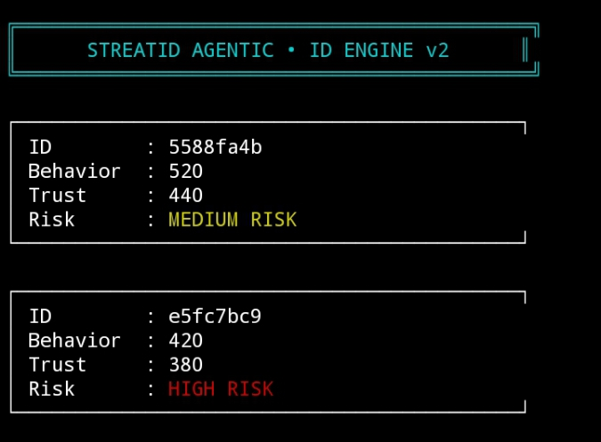

# STREATID AGENTIC • ID ENGINE v2

> A modern agent identity & trust engine built on Intercom architecture.  
> Focused on behavioral scoring, trust indexing, and dynamic risk classification.

---

## 🔷 Overview

STREATID Agentic is a decentralized identity simulation engine designed to:

- Register autonomous agents
- Track behavioral interactions
- Calculate dynamic trust index
- Classify agent risk level
- Simulate reputation-based governance logic

The engine operates through a structured CLI dashboard with a modern boxed UI.

---

## 🧠 Core Concepts

• Behavioral Score  
• Trust Index  
• Interaction History  
• Risk Classification Engine  
• Agent Lifecycle Tracking  

Trust dynamically increases with positive interactions  
Trust decreases significantly when penalized  

Risk Levels:

- LOW RISK (Green)
- MEDIUM RISK (Yellow)
- HIGH RISK (Red)

---

## ⚙️ Architecture

Engine Layer:
- Agent Registry
- Trust Calculator
- Risk Classifier
- Interaction Logger

Interface Layer:
- Boxed CLI Dashboard
- Vertical Command Menu
- Structured Agent Panels
- Color-coded Risk Output

---

## 💻 Commands

create  
interact  
penalize  
list  
exit  

---

## ▶️ How To Run

```bash
git clone https://github.com/Nawatstreat/streatid-agentic.git
cd streatid-agentic
node index.js
```

---

## 🖥 Preview Agent Dashboard



TRAC Address:
```
trac12qedvy0f5tvdqddl05m69lr5w85v02dadxs3ja46a7e7yfduawzqz2pmpn
```

---

## 🔐 Use Case

- Agent reputation modeling
- DAO identity scoring
- Governance trust filtering
- Anti-spam behavior scoring
- Autonomous network identity validation

---

## 📦 Repository Structure

contract/  
features/  
proof/  
index.js  
LICENSE.md  

---

## 📜 License

MIT License  
Open-source experimental governance engine.

---

## 🚀 Status

Version: v2  
UI: Modern Boxed Dashboard  
Engine Type: Agent Identity & Trust Simulation  
Framework: Node.js CLI  

---

Built for decentralized agent networks & Intercom-based infrastructure.
