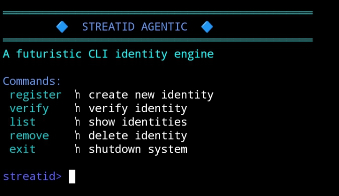

# 🔷 StreatID Agentic

A blue-themed CLI identity engine built on Intercom architecture.

StreatID Agentic simulates decentralized identity registration,
verification, and management through a futuristic terminal interface.

---

## ⚡ Features

- Identity registration
- Identity verification system
- Identity listing
- Identity removal
- Clean blue futuristic CLI interface
- Lightweight & fast execution

---

## 🚀 Installation

```bash
git clone https://github.com/Nawatstreat/streatid-agentic.git
cd streatid-agentic
npm install
node index.js
```
---

# 🔵 Preview



The screenshot demonstrates:

- CLI successfully initialized
- Blue themed identity interface active
- Command system ready
- Identity engine running without errors

---

## 🧠 Available Commands

register   → create new identity
verify     → verify existing identity
list       → list all identities
remove     → remove identity
exit       → shutdown system

---

## 🔐 Trac Address

```trac12qedvy0f5tvdqddl05m69lr5w85v02dadxs3ja46a7e7yfduawzqz2pmpn```

---

## 🧩 Built On

Node.js
Intercom-based structure
Agentic CLI simulation
🔥 StreatID Agentic — Digital identity, simplified.

---
